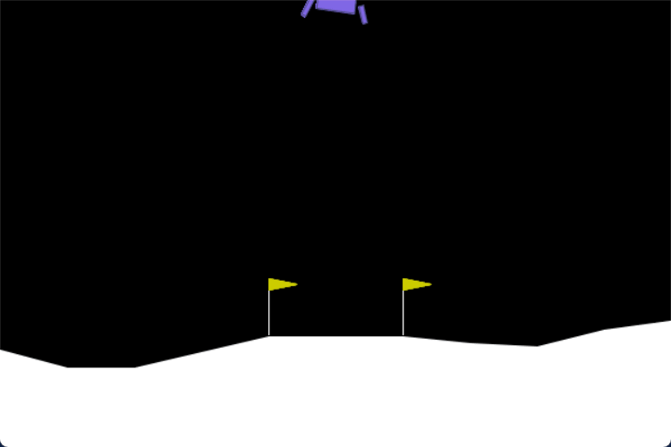
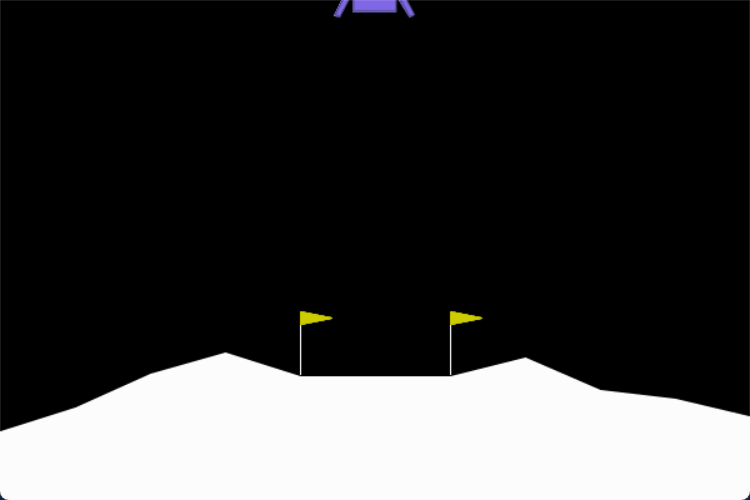

# Lunar Lander QLearning
This project trains a reinforcement learning agent for OpenAI Gymnasium's **Lunar Lander** environment!

The goal is to develop an agent that maintains stability in midair and safely lands on the landing pad while firing the thrusters as little as possible. Implementing the tabular Q-learning algorithm for this project was a fun and hands-on way to dive into reinforcement learning and get familiar with Gymnasium environments.

  
3 episodes of an untrained, random agent

  
2 episodes of the trained agent